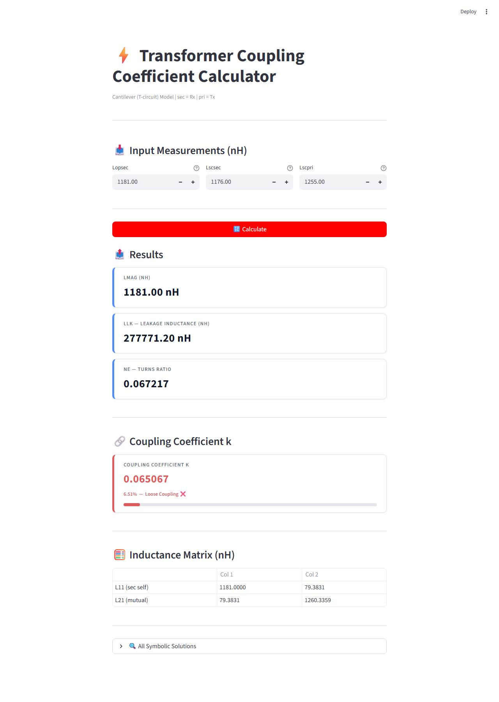

# ⚡ Transformer Coupling Coefficient Calculator

A web app for calculating the **coupling coefficient** of a transformer using the **Cantilever (T-circuit) model**.

Built with Python and Streamlit.



---

## 🌐 Live App

Access the app here: [coupling-coefficient-calculator.streamlit.app](https://coupling-coefficient-calculator.streamlit.app)

---

## 📖 How to Use

### Step 1 — Enter Your Measurements
Input your three inductance measurements (in **nH**) into the fields at the top of the app:

| Field | Description |
|-------|-------------|
| **Lopsec** | Open-circuit secondary inductance (Rx side) |
| **Lscsec** | Short-circuit secondary inductance (Rx side) |
| **Lscpri** | Short-circuit primary inductance (Tx side) |

> ⚠️ **Note:** `Lscsec` must be less than `Lopsec` for a valid solution.

---

### Step 2 — Click Calculate
Press the **🔢 Calculate** button. The app will solve for the transformer parameters using the cantilever model equations.

---

### Step 3 — Read the Results

#### 📤 Results
| Output | Description |
|--------|-------------|
| **Lmag** | Magnetizing inductance (nH) |
| **Llk** | Leakage inductance (nH) |
| **ne** | Turns ratio |

#### 🔗 Coupling Coefficient k
The coupling coefficient **k** is displayed with a color-coded status:

| Color | Range | Meaning |
|-------|-------|---------|
| 🟢 Green | k ≥ 0.9 | Tight coupling |
| 🟡 Amber | 0.5 ≤ k < 0.9 | Moderate coupling |
| 🔴 Red | k < 0.5 | Loose coupling |

A progress bar shows the coupling strength visually (0 → 1).

#### 🧮 Inductance Matrix
The 2×2 inductance matrix is shown with self and mutual inductance values.

#### 🔍 All Symbolic Solutions
Expand this section to view all mathematical solutions returned by the symbolic solver.

---

## 🧮 Theory

This app uses the **Cantilever (T-circuit) transformer model** to extract equivalent circuit parameters from three standard inductance measurements.

### Equations Solved
$$\frac{L_{mag} \cdot L_{lk}}{L_{mag} + L_{lk}} = L_{scsec}$$

$$L_{lk} \cdot n_e^2 = L_{scpri}$$

### Coupling Coefficient Formula
$$k = \frac{M}{\sqrt{L_{11} \cdot L_{22}}}$$

Where:
- **M** = Mutual inductance
- **L₁₁** = Self-inductance of secondary (Rx)
- **L₂₂** = Self-inductance of primary (Tx)

---

## 🛠️ Run Locally

### Prerequisites
- Python 3.8+
- pip

### Install Dependencies
```bash
pip install -r requirements.txt
```

### Launch the App
```bash
streamlit run app.py
```

The app will open in your browser at `http://localhost:8501`.

---

## 📁 Project Files

| File | Description |
|------|-------------|
| `app.py` | Streamlit web app |
| `coupling_calculator.py` | Standalone Python script (no UI) |
| `requirements.txt` | Python dependencies |
| `Coupling_original_Code.txt` | Original MATLAB implementation |
| `Xfmr_calcMeasureInductance.m` | MATLAB inductance measurement script |

---

## 📦 Dependencies

| Package | Purpose |
|---------|---------|
| `streamlit` | Web app framework |
| `sympy` | Symbolic math solver |
| `numpy` | Numerical calculations |
